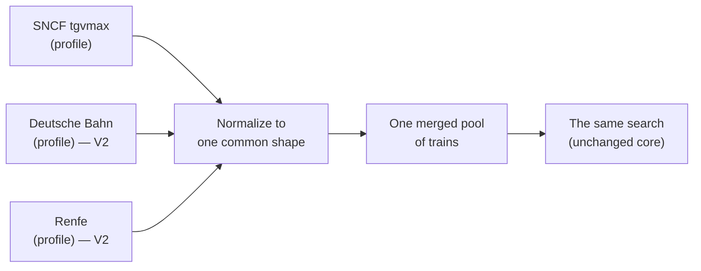

# MAX Finder

Source: [MAX-Finder](https://github.com/offware-apps/MAX-Finder), `specs/constitution.md` at abd14e8, the product constitution of `AGENTS.md` at 8041d92, and `VISION.md` at 6713945, copied verbatim. The repository's files win where this copy has drifted.

## Constitution — MAX Finder

Non-negotiable principles that govern every decision in this project. (Spec-Driven Development,
GitHub Spec Kit methodology.)

### 1. Serverless & free forever
No backend, no database, no paid infrastructure. The app must run as static files on free
hosting (GitHub Pages) and keep working indefinitely at zero cost. Any feature that would
require a server is redesigned to be client-side or scheduled (GitHub Actions), or dropped.

### 2. No accounts, privacy by default
No login, no user database, no PII, no tracking. All personalization (favorites, settings,
saved searches, watched routes) lives in the browser (localStorage) or in shareable URLs.
This keeps the app RGPD-free and removes auth as an attack surface.

### 3. Open data, honest framing
The single source of truth is the public SNCF `tgvmax` open dataset. The app is a viewer of
indicative availability — **not** a ticket seller and **not** affiliated with SNCF. Every
screen makes that clear and links out to SNCF Connect for booking.

### 4. Correctness is checkable
Core logic (search, connections, calendar) is written as pure, deterministic functions and
covered by unit tests against fixture data. Nothing about availability is invented: if the
data doesn't say a seat is free, the app doesn't claim it is.

### 5. Resilient to the data source
The site reads a committed daily JSON snapshot so it never hard-depends on the live API being
up or CORS-enabled. A live-API path exists as an enhancement/fallback, never as a requirement.

### 6. Accessible, fast, international
Mobile-first, keyboard-navigable, screen-reader friendly (WCAG AA targets). Small bundle.
French and English from day one (French is the primary audience).

### 7. FOSS and contributor-friendly
AGPL-3.0 licensed. Readable code that matches its own conventions. Spec/plan/tasks kept in the repo
so contributors understand intent before code.

## Product constitution

These are the standing rules for every change. When a decision is unclear, pick the option
that best satisfies these, in order:

1. **Intuitive and easy above all.** A first-time user must understand each screen without
   thinking. Simplicity and obviousness beat cleverness and feature density.
2. **Zero truncated text on mobile — anywhere.** No station name, chip, duration, count, or
   heading may be clipped at ≤390px. Text wraps and fits; it is never cut off with an
   ellipsis or overflow. Verify at 390px with long names (e.g. Saint-Pierre-des-Corps,
   Aix-en-Provence TGV).
3. **Efficiency over casual framing.** This is a power-user tool. Prefer direct, efficient
   controls over cute/casual copy and presets (avoid "this weekend / next week"-style
   framing). Minimise clicks; never ask the same thing twice.
4. **Performance is a feature, and it must degrade gracefully.** Keep heavy work off the
   main thread and prefer algorithmic fixes over hiding cost. Low-end devices/users must
   always have a working escape hatch (Settings → low-end mode: reduced motion, map off,
   compact) that meaningfully removes lag. If something lags, the low-end setting must cover
   it.
5. **No feature may break 1–3** to satisfy 4 (or vice versa).

## Vision — MAX Finder

Where MAX Finder is today, and where it's headed. For the day-to-day of *how it
works now*, see [`docs/how-it-works.md`](https://github.com/offware-apps/MAX-Finder/blob/main/docs/how-it-works.md) and
[`docs/algorithms.md`](https://github.com/offware-apps/MAX-Finder/blob/main/docs/algorithms.md). The non-negotiable principles live in
[`specs/constitution.md`](https://github.com/offware-apps/MAX-Finder/blob/main/specs/constitution.md).

---

### Today (V1): SNCF, done well

MAX Finder finds SNCF trains where a free **MAX JEUNE / MAX SENIOR** seat is
reservable, from SNCF open data — Where to?, Where from?, Exact trip, Tour, Ideas,
round trips and night trains, all serverless and account-free. **This is and stays
the heart of the app**, and the branding stays SNCF / MAX.

The data layer already has the seam V2 builds on: a **`DatasetProfile`**
(`src/data/profile.ts`) that holds everything about *reading and judging one
dataset* (field mapping, the "is this seat bookable?" rule, hubs, non-bookable
stops). The core search only ever sees the neutral, normalized train shape.

---

### The V2 goal: trains beyond France 🇫🇷 → 🇪🇺

Add other countries' trains — **Germany (Deutsche Bahn), Spain (Renfe), …** — so one
app covers more of Europe. SNCF remains the centre; other networks are added as
**extra data sources merged into the same search**, not a rewrite. A traveller
should be able to plan a trip that crosses a border without leaving the app.

### Why it's within reach

The core algorithms (search, connections, round trips, tours) already run on a
neutral `MaxTrain` shape, and the V1 `DatasetProfile` seam means **a new operator is
"another profile", not new core code**. The shape of V2 is mostly at the edges:
loading several sources and merging them, plus some UI honesty about what each
train is.

---

### What V2 needs (the phases)

1. **Hubs through the profile.** Connections currently default to the French hub
   list; make each source contribute its own interchange hubs.
2. **Merge multiple sources into one pool.** Load SNCF + DB + … together and
   normalize them into a single searchable set (instead of one profile at a time).
3. **Define "bookable" for a non-MAX operator.** DB and Renfe have no MAX seat, so
   each source decides what to highlight — e.g. "the train runs", a saver fare, or
   its own pass concept — and the UI shows that honestly.
4. **Foreign stations + cross-border rules.** Add coordinates for foreign stations
   for the map, and revisit `NON_BOOKABLE_PATTERNS` (today it *excludes* Geneva,
   Brussels, etc. — with more countries, some of those become bookable).
5. **UI treatment of non-MAX trains.** A clear label / badge so a German or Spanish
   train isn't mistaken for a free MAX seat, plus optional per-operator filters.

---

### Open questions (to settle when V2 starts)

- **What counts as "available / highlighted"** for each non-MAX operator?
- **Where does each country's data come from** — is there suitable open data (like
  SNCF's `tgvmax`) for DB, Renfe, etc., and under what licence?
- **Station coordinates** for foreign stations (for the map and distance sorting).
- **Cross-border connections** — which foreign stations act as hubs, and how to keep
  the connection search fast across a bigger network.
- **Booking links** — a per-operator "book this" target instead of one SNCF Connect
  deep link.

---

### Principles that don't change (V1 → V2)

Whatever we add, the app stays **serverless, free forever, account-free, and
private** — everything runs in the browser on static files, refreshed by scheduled
jobs, with favourites and settings never leaving the device. See
[`specs/constitution.md`](https://github.com/offware-apps/MAX-Finder/blob/main/specs/constitution.md).
